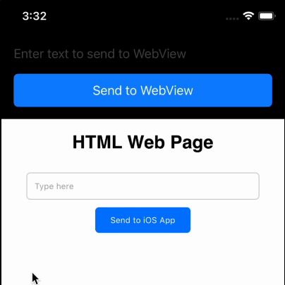

# iOSWebViewInterop

This repo contains the full source code for iOSWebViewInterop, an iOS app that shows how to make bidirectional interop between iOS app and HTML/JS from WKWebView

---

* [Requirements](#requirements)
* [License](#license)

# Requirements

* iOS 15.0
* Xcode 15
* Swift 5.9

# License

The source code in this repository may be run and altered for education purposes only and not for commercial purposes. For more information see our full [license](LICENSE.md).